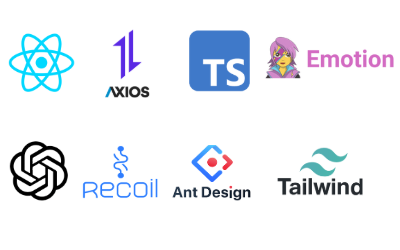

# Aca Match

### 📅 프로젝트 기간

**2025.1.9 ~ 2025.2.11**

---

---

### 💻 **사용 언어 및 라이브러리**

---

## ⭐ 주요 기능

#### 🔍 **팀장 : 김기동**

- **홈페이지**
  - 태그로 학원 검색 및 인기 태그로 학원 검색으로 이동가능합니다.
  - 사이트의 사용현황 확인가능 및 추천 학원 출력이 됩니다.
- **학원 검색**
  - 학생이 원하는 지역과 조건을 설정하여 학원을 검색할 수 있습니다.
  - 별점 순서로 학원이 정렬됩니다.
- **학원 상세페이지**
  - 학원 소개를 볼수 있으며 신청이 가능합니다.
  - 학원 수업 정보를 캘린더에 출력되며 일정이 표시됩니다.
  - 학원 위치를 지도에 출력이 됩니다.
  - 좋아요 등록 및 리뷰 작성이 가능합니다
- **화제의 학원**
  - 좋아요 순서의 학원이 출력됩니다.
- **고객 지원**
  - 자주 물어보는 질문으로 사이트 이용에 설명이 작성되어있습니다.
- **그 외의 기능**
  - 로그인 및 회원가입 가능합니다.
  - 회원가입 및 비밀번호 재설정시 메일로 인증후 이용이 가능합니다.
  - 1:1 문의가 도착했을때 알림이 표시가 됩니다.
  - AI 성적 분석 기능을 제공하여 학업 성취도를 관리할 수 있습니다.

#### 📊 **팀원 : 김재범**

- **마이페이지 공통**

  - 내 정보 수정가능합니다.
  - 좋아요 및 리뷰를 삭제, 수정, 조회할 수 있습니다.

- **마이페이지 학원 관리자**

  - 학원을 등록 및 수정, 삭제가 가능합니다.
  - 학원 운영자가 수강생을 관리하고, 시험 일정을 등록할 수 있습니다.
  - 엑셀로 학생의 시험데이터를 출력이 가능합니다.

- **마이페이지 학생**
  - 등록한 학원의 정보를 조회할 수 있습니다.
  - 성적을 조회할수 있습니다.
  - 보호자를 등록이 가능합니다.
- **마이페이지 학부모**
  - 자녀의 정보를 조회할 수 있습니다.
  - 자녀를 등록할 수 있습니다.

## 🚀 기대 효과

- 학생들에게 최적의 학원을 추천하여 맞춤형 학습 기회를 제공합니다.
- 학원의 운영을 효율적으로 관리할 수 있도록 도와줍니다.
- AI 기반의 학습 분석을 통해 교육의 질을 향상시킵니다.

## 📅 프로젝트 일정

- **2025.01.09**: 프로젝트 시작, 초기 설계 및 개발 계획 수립
- **2025.01.11**: 기능 설계 완료, 기본 UI 디자인 시작
- **2025.01.16**: 피그마 작업 완료
- **2025.01.23**: 퍼블리싱 완료
- **2025.02.09**: 최종 버그 수정 및 기능 테스트
- **2025.02.11**: 프로젝트 종료, 최종 리뷰 및 발표

## 🎯 향후 개선사항

- **디자인 향상**: UI/UX 디자인 개선을 통해 사용자 경험을 높일 예정입니다.
- **기능 추가**: 사이트 관리자 페이지를 추가할 예정입니다.

---
